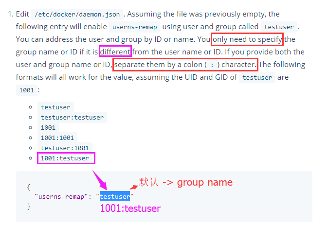

# docker daemon.json 配置文件

`daemon.json` 配置方式
+ `Linux`: `/etc/docker/daemon.json`
+ `Windows Server`: `C:\ProgramData\docker\config\daemon.json`
+ `Docker for Mac` / `Docker for Windows`: Click the Docker icon in the toolbar, select `Preferences`, then select `Daemon`. Click `Advanced`.

### daemon.json 配置

### 镜像加速器

```json
// 配置一个
{
  "registry-mirrors": ["https://registry.docker-cn.com"]
}

// 配置多个
{
  "registry-mirrors": ["https://registry.docker-cn.com","https://docker.mirrors.ustc.edu.cn"]
}
```

> 镜像加速器常用值：
>> `docker-cn 官方` : `https://registry.docker-cn.com`
>>
>> `中科大` : `https://docker.mirrors.ustc.edu.cn`

### 日志

```json
{
  "debug": true,
  "log-level": "info"
}
```

> `log-level` 的有效值包括: `debug`, `info`, `warn`, `error`, `fatal`


### 监控 Prometheus

> https://docs.docker.com/engine/admin/prometheus/#configure-docker

```json
{
  "metrics-addr" : "127.0.0.1:9323",
  "experimental" : true
}
```


### 保持容器在线

> https://docs.docker.com/engine/admin/live-restore/#enable-the-live-restore-option

当 `dockerd` 进程死掉后， 依旧保持容器存活。

```json
{
  "live-restore": true
}
```

Linux 重载 docker daemon

```bash
$ sudo kill -SIGHUP $(pidof dockerd)
```


### 设置 `镜像、容器、卷` 存放目录和驱动

> https://docs.docker.com/engine/admin/systemd/#runtime-directory-and-storage-driver

下述两个参数可以单独使用

```json
{
    "graph": "/mnt/docker-data",
    "storage-driver": "overlay"
}
```

`graph`: 设置存放目录
+ `Docker Root Dir: /mnt/docker-data`

`storage-driver`: 设置存储驱动
+ `Storage Driver: overlay`


### user namespace remap

> https://docs.docker.com/engine/security/userns-remap/#enable-userns-remap-on-the-daemon

安全设置： 用户空间重映射

`userns-remap` 的值可以是
如果值字段 `只有` 一个值， 那么该字段表示 `组`。
如果需要同时指定 `用户` 和 `组`, 需要使用 `冒号` 分隔，格式为  `用户:组`

+ `组`
+ `用户:组`
+ `组` 或 `用户` 的值可以是组或用户的 `名称` 或 `ID`。
  + `testuser`
  + `testuser:testuser`
  + `1001`
  + `1001:1001`
  + `testuser:1001`
  + `1001:testuser`

```json
{
  "userns-remap": "testuser"
}

// 或同时指定 用户和组，且使用 名称和ID
{
  "userns-remap": "testuser:1001"
}
```

```bash
$ dockerd --userns-remap="testuser:testuser"
```

> `userns-remap` 使用不多，但并不是不重要。目前不是默认启用的原因是因为一些应用会**假定** uid 0 的用户拥有特殊能力，从而导致假定失败，然后报错退出。所以**如果要启用 user id remap，你要充分测试一下**。但是启用 uid remap 的安全性提高是明显的。

