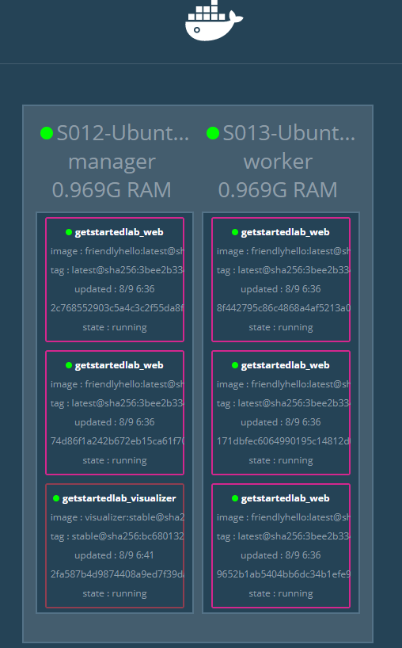

# stack

> https://docs.docker.com/get-started/part5/

##  Introduction

A `stack` is a group of `interrelated(相关的) services` that **share** dependencies, and can be **orchestrated(编排)** and **scaled** together. A single stack is capable of `defining(定义) and coordinating(协调)` the functionality of an entire application (though very complex applications may want to use multiple stacks).

> 所以， stack 就是，不同任务的调度器。

发布 `stack` 使用命令 `docker stack deploy`


## Add a new service and redeploy

和 [上一节](04.swarm.md) 一样，我们这里需要两个节点 `S12` 和 `S13`.

| 节点名 | 节点角色 | IP 地址 | 系统版本 | Docker 版本 |
| --- | --- | --- | --- | --- | --- |
| S12 | Manager | 192.168.56.212 | Ubuntu 1604.03 | Docker-ce 17.06 |
| S12 | Worker | 192.168.56.213 | Ubuntu 1604.03 | Docker-ce 17.06 |


上一节中，最后已经删除了 `stack`, 退出了 `swarm`。

### 创建集群

注意执行命令的机器

```bash
# 创建集群
[user@S012 05.stack_sample]$ docker swarm init --advertise-addr 192.168.56.212

# S13 加入集群
[user@S013 ~]$ docker swarm join --token SWMTKN-1-3096uq30z7u8x5qt5uy7zfhevd5uet5os5s7a84a5b908clxh2-dattjfqr3pw9sjcsqvfiyk4ri 192.168.56.212:2377

# 查看节点信息
[user@S012 05.stack_sample]$ docker node ls
ID                            HOSTNAME            STATUS              AVAILABILITY        MANAGER STATUS
69im9oe8rljfjbh600dnyulks *   S012    Ready               Active              Leader
nqhgz9accdqorokp6ct47c262     S013    Ready               Active  

# 创建 stack 服务
[user@S012 05.stack_sample]$ docker stack deploy -c docker-compose.yml getstartedlab
Creating network getstartedlab_webnet
Creating service getstartedlab_web

# 查看 stack 信息
[user@S012 05.stack_sample]$ docker stack  ps getstartedlab
ID                  NAME                  IMAGE                          NODE                DESIRED STATE       CURRENT STATE           ERROR               PORTS
jco8fikcn0zf        getstartedlab_web.1   octowhale/friendlyhello:latest   S013    Running             Running 2 minutes ago                       
x0w43zxui0oa        getstartedlab_web.2   octowhale/friendlyhello:latest   S012    Running             Running 2 minutes ago                       
ofbupicgj1af        getstartedlab_web.3   octowhale/friendlyhello:latest   S013    Running             Running 2 minutes ago                       
30a16pv6ov4k        getstartedlab_web.4   octowhale/friendlyhello:latest   S013    Running             Running 2 minutes ago                       
iv33enuysiu2        getstartedlab_web.5   octowhale/friendlyhello:latest   S012    Running             Running 2 minutes ago    
```


### 更新 docker-compose 文件

```yaml
# docker-compose-visualizer.yml
version: "3"
services:
  web:
    # replace username/repo:tag with your name and image details
    image: username/repo:tag
    deploy:
      replicas: 5
      restart_policy:
        condition: on-failure
      resources:
        limits:
          cpus: "0.1"
          memory: 50M
    ports:
      - "80:80"
    networks:
      - webnet
  visualizer:
    image: dockersamples/visualizer:stable
    ports:
      - "8080:8080"
    volumes:
      - "/var/run/docker.sock:/var/run/docker.sock"
    deploy:
      placement:
        constraints: [node.role == manager]
    networks:
      - webnet
networks:
  webnet:
```

The only thing **new** here is the peer service to `web`, named `visualizer`. You’ll see two new things here:
+ a `volumes` key, giving the visualizer access to the host’s socket file for Docker,
+ and a `placement` key, ensuring that this service **only ever runs on a swarm manager** – never a worker. That’s because this container, built from an open source project created by Docker, displays Docker services running on a swarm in a diagram.


重新执行 `docker stack deploy` 更新 **getstartedlab** 服务。

```bash
# 更新 getstartedlab
[user@S012 05.stack_sample]$ docker stack deploy -c docker-compose-visualizer.yml getstartedlab
Updating service getstartedlab_web (id: 7m4i1ily612f8mk9jh7pt7jpv)
Creating service getstartedlab_visualizer

# 查看节点信息
[user@S012 05.stack_sample]$ docker stack ps getstartedlab
ID                  NAME                         IMAGE                             NODE                DESIRED STATE       CURRENT STATE            ERROR               PORTS
7p8pt9dqp2ww        getstartedlab_visualizer.1   dockersamples/visualizer:stable   S012    Running             Running 16 seconds ago                       
jco8fikcn0zf        getstartedlab_web.1          octowhale/friendlyhello:latest      S013    Running             Running 5 minutes ago                        
x0w43zxui0oa        getstartedlab_web.2          octowhale/friendlyhello:latest      S012    Running             Running 5 minutes ago                        
ofbupicgj1af        getstartedlab_web.3          octowhale/friendlyhello:latest      S013    Running             Running 5 minutes ago                        
30a16pv6ov4k        getstartedlab_web.4          octowhale/friendlyhello:latest      S013    Running             Running 5 minutes ago                        
iv33enuysiu2        getstartedlab_web.5          octowhale/friendlyhello:latest      S012    Running             Running 5 minutes ago   
```

可以看到 `getstartedlab_visualizer.1` 只启动了一个，并且运行在 `S12` 上。
The visualizer is a standalone service that can run in any app that includes it in the stack. It doesn’t depend on anything else.

通过 `http://192.168.56.212:8080/` 或 `http://192.168.56.213:8080/` 都可以看到 `visualizer` 界面。因为 `swarm` 共享了入口(`ingress routing mesh`)。



## Persist the data

为容器添加持久化数据 `redis`。

修改 `docker-compose.yml` 增加 `redis` 部分

```yml
# docker-compose-visualizer-redis.yml
version: "3"
services:
  web:
    # replace username/repo:tag with your name and image details
    image: username/repo:tag
    deploy:
      replicas: 5
      restart_policy:
        condition: on-failure
      resources:
        limits:
          cpus: "0.1"
          memory: 50M
    ports:
      - "80:80"
    networks:
      - webnet
  visualizer:
    image: dockersamples/visualizer:stable
    ports:
      - "8080:8080"
    volumes:
      - "/var/run/docker.sock:/var/run/docker.sock"
    deploy:
      placement:
        constraints: [node.role == manager]
    networks:
      - webnet
  redis:
    image: redis
    ports:
      - "6379:6379"
    volumes:
      - ./data:/data
    deploy:
      placement:
        constraints: [node.role == manager]
    networks:
      - webnet
networks:
  webnet:
```

here in our Compose file we expose it from the host to the world, so you can `actually enter the IP` for any of your nodes into Redis Desktop Manager and manage this Redis instance, if you so choose.

`Most importantly`, there are a couple of things in the redis specification that `make data persist` between deployments of this stack:

  + redis always `runs on the manager`, so it’s always using the `same filesystem`.
  + redis accesses an **arbitrary(任意)** directory in the host’s file system `as /data inside` the container, which is where Redis stores data.

Together, this is creating a “source of truth” in your host’s physical filesystem for the Redis data. `Without this`, Redis would store its data in `/data` inside the container’s filesystem, which would `get wiped out` if that container were ever redeployed.

This source of truth has two components:

  + The placement constraint you put on the Redis service, ensuring that it `always uses the same host`.
  + The volume you created that lets the container access `./data (on the host)` as `/data (inside the Redis container)`. While containers come and go, the files stored on ./data on the specified host will persist, enabling continuity.**(如果不映射本地路径到 redis 容器 /data 中，那么当容器关闭后，redis 数据就会消失，无法达到数据持久化的目的)**


更新 **getstartedlab** 服务

```bash
# 创建 redis 数据目录
[user@S012 05.stack_sample]$ mkdir -p ./data

# 更新服务
[user@S012 05.stack_sample]$ docker stack deploy -c docker-compose-visualizer-redis.yml getstartedlab
Updating service getstartedlab_web (id: 7m4i1ily612f8mk9jh7pt7jpv)
Updating service getstartedlab_visualizer (id: gjxq5cczcypoeoad3e41befzy)
Creating service getstartedlab_redis
```

访问 `http://192.168.56.212:8800/` 就可以看到页面已经支持计数器了。


Also, check the visualizer at port 8080 on either node’s IP address, and you’ll see the `redis` service running along with the `web` and `visualizer` services.


