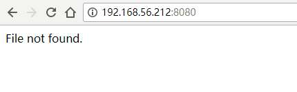
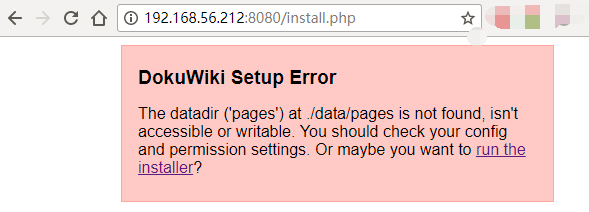
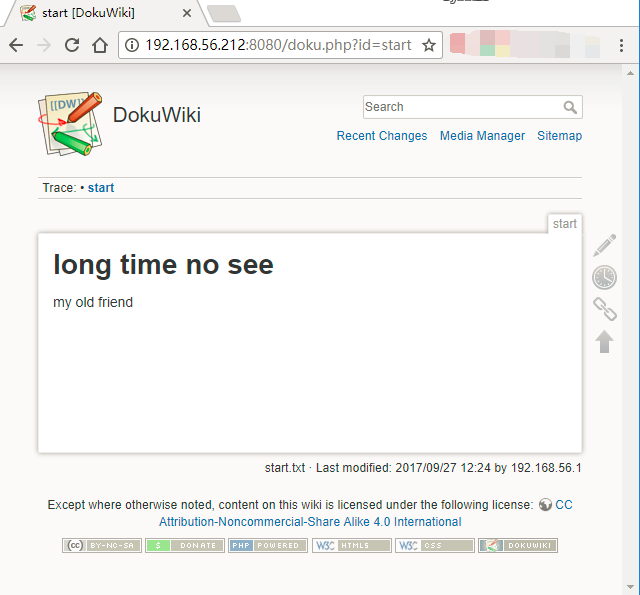

# nginx-php docker-compose 实践

总结：

+ `php file not found`: 因为 `php` 容器找不到 `php` 文件
  + 将 `dokuwiki` 也映射到 `php` 容器即可
+ `permission denied` : 因为容器中跑 `fpm` 的 `用户ID` 与 `本地用户ID` 不同，从而导致容器无法修改 `dokuwiki` 目录中的文件。
  + 创建 `dockerfile` 重新 `build` php 镜像，是二者 `用户ID` 一致即可。

## php file not found

之前一直在同一台机器上配置 `php` 和 `nginx` ， 因此用来没注意到， php 程序需要对 `nginx root` 目录有访问权限。

在 `docker` 实践中

+ 出问题： 没有映射 `dokuwiki-2017-02-19e` 目录到 `php` container 中， 因此一直报 `file not found`

```yaml
services:

  nginx:
    volumes:
      - ./dokuwiki-2017-02-19e:/usr/share/nginx/html
      - ./nginx.conf:/etc/nginx/conf.d/default.conf:ro

  php:
    volumes:
      # - ./dokuwiki-2017-02-19e:/usr/share/nginx/html

```



+ 解决问题： 经过排查， 同时将 `dokuwiki-2017-02-19e` 目录映射到  `php` 和 `nginx` 容器中。问题解决。

```yaml
services:

  nginx:
    volumes:
      - ./dokuwiki-2017-02-19e:/usr/share/nginx/html
      - ./nginx.conf:/etc/nginx/conf.d/default.conf:ro

  php:
    volumes:
      - ./dokuwiki-2017-02-19e:/usr/share/nginx/html

```



## permission denied

虽然， `php` 文件可以正常解析了。但是，由于通过 `volumes` 将本地目录映射到容器中，由于用户属主问题，容器中的 `nginx` 和 `php` 进程无法对该目录进行修改。

因此， 我们需要重新定制 `php` 的镜像， 使 `www-data` 的用户 `ID` 从 `82` 变为 `1000`。**注意，因为我测试机上用户的 `ID` 是 `1000`** 。

创建 `php` 镜像的 `dockerfile` : `dokuwiki-php.Dockerfile`

```Dockerfile
FROM php:7.2-rc-fpm-alpine

LABEL maintainer octowhale

# https://github.com/docker-library/php/blob/7c45279501f958926e51779081bc083fbb412539/7.2-rc/alpine/Dockerfile
# https://github.com/chrootLogin/docker-nextcloud/issues/3
RUN set -x \
    && deluser www-data   \
    # && delgroup www-data  \
    && addgroup -g 1000 -S www-data \
    && adduser -u 1000 -D -S -G www-data www-data

# RUN echo http://dl-2.alpinelinux.org/alpine/edge/community/ >> /etc/apk/repositories    \
#     && apk --no-cache add shadow \
#     && usermod -u 1000 www-data

# ENTRYPOINT ["docker-php-entrypoint"]
# CMD ["php", "-a"]
```

修改 `docker-compose.yml`， 不使用官方镜像， 而是使用我们自己的魔改版。

```yaml
...
  php:
    # image: php:7.2-rc-fpm-alpine
    build:
      context: .
      dockerfile: dokuwiki-php.Dockerfile
...

```

重新执行 `docker-compose up` 命令之后，这样一切都正常了。




## 配置文件


### docker-compose.yml

```yaml
version: "3.3"

services:

  nginx:
    image: nginx:latest
    networks:
      - frontend    
    ports:
      - 8080:80
    depends_on:
      - php
    volumes:
      - ./dokuwiki-2017-02-19e:/usr/share/nginx/html
      # - ./nginx.conf:/etc/nginx/nginx.conf:ro
      - ./nginx.conf:/etc/nginx/conf.d/default.conf:ro


  php:
    # image: php:7.2-rc-fpm-alpine
    build:
      context: .
      dockerfile: dokuwiki-php.Dockerfile
    networks:
      - frontend
      - middleend
    volumes:
      - ./dokuwiki-2017-02-19e:/usr/share/nginx/html


networks:
  frontend:
  middleend:

```

### dokuwiki-php.Dockerfile

```Dockerfile
FROM php:7.2-rc-fpm-alpine

LABEL maintainer octowhale

# https://github.com/docker-library/php/blob/7c45279501f958926e51779081bc083fbb412539/7.2-rc/alpine/Dockerfile
# https://github.com/chrootLogin/docker-nextcloud/issues/3
RUN set -x \
    && deluser www-data   \
    # && delgroup www-data  \
    && addgroup -g 1000 -S www-data \
    && adduser -u 1000 -D -S -G www-data www-data

# RUN echo http://dl-2.alpinelinux.org/alpine/edge/community/ >> /etc/apk/repositories    \
#     && apk --no-cache add shadow \
#     && usermod -u 1000 www-data

# ENTRYPOINT ["docker-php-entrypoint"]
# CMD ["php", "-a"]

```

### nginx.conf

```ini
server {
    listen 80;
    server_name localhost;
    charset utf-8;

    root   /usr/share/nginx/html;
    index  index.php index.html index.htm;

    gzip on;
    gzip_disable "msie6";
    gzip_types text/plain text/css text/xml text/javascript application/json
        application/x-javascript application/xml application/xml+rss application/javascript;

    error_page 404 = /index.php;
    access_log off;
    error_log /var/log/nginx/error.log crit;

    client_max_body_size 64m;

    location / {
        try_files $uri $uri/ /index.php?$args;
    }

    location /. {
        return 404;
    }

    location ~ \.php$ {
         include fastcgi_params;
         try_files $uri =404;
         fastcgi_pass php:9000;
         fastcgi_split_path_info ^(.+\.php)(/.+)$;
         fastcgi_read_timeout 300;
         fastcgi_param SCRIPT_FILENAME $document_root$fastcgi_script_name;
         #  fastcgi_param SCRIPT_FILENAME /usr/share/nginx/html$fastcgi_script_name;
         fastcgi_index index.php;
    }
    location ~ /\.ht {
        deny  all;
    }
}

```