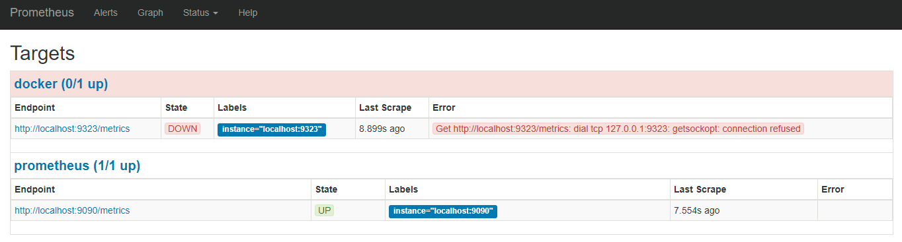

# 使用 Promethues 收集 Docker 性能指标

> 只讲如何在 Linux 下配置 Prometheus。 其他操作系统，直接看 [原文](https://docs.docker.com/engine/admin/prometheus/) 。其实也没什么也看的

[Prometheus](https://prometheus.io/) 是一个开源监控和报警工具。可以将 Docker 作为其监控目标。本文将启动一个 Prometheus 容器，并兼容 Docker 实例。

> 警告：本文中所有可用的指标和其名字都可能在将来的版本中发生变化。

目前，你只能监控 Docker 本身，而不能监控 Docker 容器中的程序。

## 环境信息

```yaml
#  操作系统版本
Kernel Version: 4.4.0-93-generic
Operating System: Ubuntu 16.04.3 LTS

# Docker 版本
Server Version: 17.09.0-ce

# prometheus 版本
prometheus, version 1.8.1 (branch: HEAD, revision: 3a7c51ab70fc7615cd318204d3aa7c078b7c5b20)
  build user:       root@ab78fb101775
  build date:       20171023-15:50:57
  go version:       go1.9.1
```

## 配置 Docker

将 Docker daemon 配置为 Prometheus 的目标，你需要指定 `metrics-address`。当然最为推荐的方法就配置 `/etc/docker/daemon.json`。 注意 `json` 文件格式。

```json
{
  "metrics-addr" : "127.0.0.1:9323",
  "experimental" : true
}
```

加载 dockerd 配置

```bash
$ sudo kill -SIGHUP $(pidof dockerd)
```

现在 Docker 在 9323 端口上公开 `Prometheu-兼容指标`。

## 配置和启动 Prometheus

本例中， Prometheus 将通过 Docker 容器提供服务。

将下述配置文件保存到 `/tmp/prometheus.yml` 中

```yaml
# my global config
global:
  scrape_interval:     15s # Set the scrape interval to every 15 seconds. Default is every 1 minute.
  evaluation_interval: 15s # Evaluate rules every 15 seconds. The default is every 1 minute.
  # scrape_timeout is set to the global default (10s).

  # Attach these labels to any time series or alerts when communicating with
  # external systems (federation, remote storage, Alertmanager).
  external_labels:
      monitor: 'codelab-monitor'

# Load rules once and periodically evaluate them according to the global 'evaluation_interval'.
rule_files:
  # - "first.rules"
  # - "second.rules"

# A scrape configuration containing exactly one endpoint to scrape:
# Here it's Prometheus itself.
scrape_configs:
  # The job name is added as a label `job=<job_name>` to any timeseries scraped from this config.
  - job_name: 'prometheus'

    # metrics_path defaults to '/metrics'
    # scheme defaults to 'http'.

    static_configs:
      - targets: ['localhost:9090']

  - job_name: 'docker'
         # metrics_path defaults to '/metrics'
         # scheme defaults to 'http'.

    static_configs:
      - targets: ['localhost:9323']
```

启动一个 **单副本** 的 Promethues 服务

```bash
$ docker service create --replicas 1 --name my-prometheus \
    --mount type=bind,source=/tmp/prometheus.yml,destination=/etc/prometheus/prometheus.yml \
    --publish 9090:9090/tcp \
    prom/prometheus
```

> 注意： 如果你的 Docker Host 没有加入到集群中，系统会提示你先 `docker swarm init`

通过 web 页面访问查看结果 


## 使用 prometheus

点击 **Graphs** ， 在 **下拉菜单** 中选择一个 **指标参数** , 点击 **Execute**。 

屏幕上就会绘制所选择的监控图。


为了让监控图看起来更有趣一个点， 创建一个 10 个副本的服务，不停的 `ping` 。

```bash
$ docker service create \
  --replicas 10 \
  --name ping_service \
  alpine ping docker.com
```


观察完成后，停止并删除 `ping_service`。

```bash
$ docker service rm pingservice
```

等几分钟后，你应该开可以看到监控图又回到了空闲级别。


## 实验说明 

1. `daemon.json` 中的配置的 `metrics-address` 指标，在我的监控图中报错



可能正如文章开头所言，监控的 `metrics` 已经失效了。

2. Prometheus 中 **Graph** 下拉菜单中的监控项目名称与官网文档中的不一样。通过本文，可以初步搭建一个监控。

## 下一步

访问 Promethues 获取更多信息。